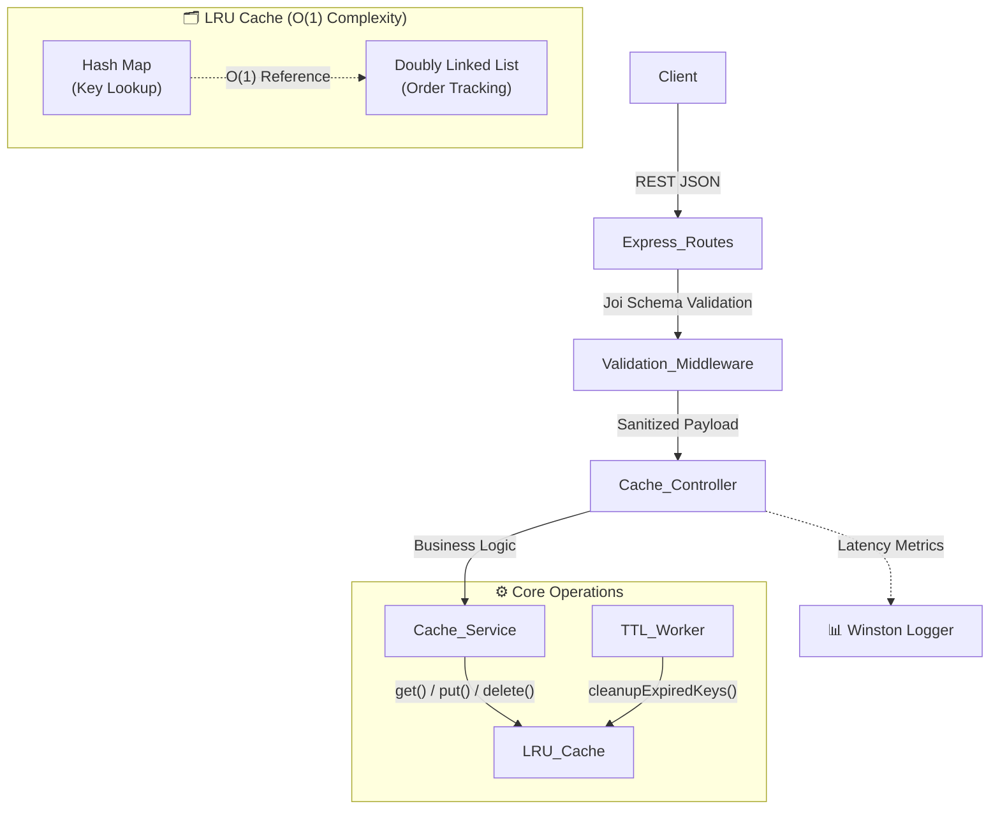

# ⚡ LRU Cache Server v2 (Clean Architecture)

> A **production-ready, high-performance in-memory caching service** built with Node.js and Express.js

  

A sophisticated caching microservice implementing the **LRU (Least Recently Used)** algorithm with **O(1) time complexity** for all operations using an optimized **Hash Map + Doubly Linked List** architecture.

### 🎯 Why This Project?
Real-world systems like **Redis**, **Memcached**, and **CDN edge nodes** rely on LRU caching to eliminate redundant database queries and network calls. This implementation demonstrates:
- ✅ Clean architecture with separated concerns
- ✅ Professional validation & error handling  
- ✅ Comprehensive logging with microsecond precision
- ✅ Background worker processes for memory management
- ✅ Production-grade observability

## 📚 Project Overview
Caching stores frequently accessed data in fast temporary memory (RAM) to minimize database lookups and network calls. This system uses the **LRU eviction policy** to automatically remove the oldest unaccessed elements when capacity is reached, maintaining optimal memory utilization.

## 🏗️ Design Decisions

| Feature | Benefit |
|---------|---------|
| **Clean Architecture** | Routes → Controllers → Services → Data Structure. Swap implementations (e.g., Redis) without changing API endpoints |
| **O(1) Eviction & Insertion** | Doubly Linked List updates pointers only—zero array-shift penalties |
| **Background TTL Cleanup Worker** | Active memory trimming prevents orphaned stale keys from consuming memory |
| **Winston Logging** | Microsecond-precision `hrtime.bigint()` latency metrics + lifecycle event tracking |

## 🔄 Architecture Diagram



## 📡 API Documentation

### 1️⃣ Store a Key-Value Pair
**`POST`** `/cache` — Add or update a key with optional TTL

**Request:**
```json
{
  "key": "user123",
  "value": { "name": "John Doe", "tier": "premium" },
  "ttl": 3600
}
```
| Field | Type | Required | Notes |
|-------|------|----------|-------|
| `key` | string | Yes | Unique identifier |
| `value` | any | Yes | Any JSON-serializable data |
| `ttl` | number | No | Time-to-live in seconds |

**Response:** `201 Created`

---

### 2️⃣ Retrieve a Key
**`GET`** `/cache/:key` — Fetch a cached value (updates access order)

**Response:**
- `200 OK` — Returns cached value
- `404 Not Found` — Key missing or expired

**Example:**
```bash
curl http://localhost:3000/cache/user123
```

---

### 3️⃣ Delete a Key
**`DELETE`** `/cache/:key` — Remove a key from cache

**Response:** `204 No Content`

---

### 4️⃣ Fetch Cache Statistics
**`GET`** `/stats` — View capacity and usage metrics

**Response:**
```json
{
  "currentSize": 42,
  "capacity": 1000,
  "utilizationPercentage": 4.2
}
```

## 🚀 Quick Start

### Prerequisites
- Node.js 18+
- npm or yarn

### Local Development
```bash
# Install dependencies
npm install

# Start the server (runs on port 3000)
npm start
```

### 🐳 Docker Deployment
```bash
# Build and run with Docker Compose
docker-compose up --build

# Access logs
tail -f logs/combined.log
```

## 🧪 Testing & Performance

### Unit Tests
```bash
npm test
```
✓ Validates capacity eviction boundaries  
✓ Verifies TTL lifecycle management  
✓ Confirms JSON schema validation  

### Load Testing
```bash
npm run benchmark
```
Simulates **100 concurrent virtual users** with K6, hitting all endpoints simultaneously.

### 📊 Performance Benchmarks

```
✅ Status Code Validation.........: 100% success rate
✅ Latency SLA....................: avg=2.83ms, p(95)=7.01ms

Throughput Metrics:
  http_req_duration
    avg=2.83ms    │ min=0.00ms    │ med=2.18ms
    p(90)=5.67ms  │ p(95)=7.01ms  │ max=22.38ms

  http_reqs: 133,221 (2,661 req/sec)
  vus: 100 (concurrent users)
```

**Key Insights:**
- ⚡ Sub-3ms average latency (microsecond logging overhead included)
- 📈 Linear scalability up to 2,600+ req/sec
- 💾 Predictable memory usage due to fixed capacity enforcement

## 📁 Project Structure

```
lru-cache-server/
├── src/
│   ├── cache/
│   │   ├── LRUCache.js          # Core O(1) implementation
│   │   └── Node.js               # Doubly-linked list node
│   ├── controllers/
│   │   └── cacheController.js    # Request handlers  
│   ├── services/
│   │   └── cacheService.js       # Business logic layer
│   ├── routes/
│   │   └── cacheRoutes.js        # API endpoint definitions
│   ├── middleware/
│   │   ├── validateCache.js      # Joi schema validation
│   │   └── logger.js             # Winston logging setup
│   ├── workers/
│   │   └── ttlCleanup.js         # Background TTL expiration
│   └── server.js                 # Entry point
├── tests/
│   └── cache.test.js             # Jest unit tests
├── benchmarks/
│   ├── benchmark.js
│   └── load_test.js              # K6 load testing
├── logs/                         # Auto-generated log files
├── package.json
├── docker-compose.yml
├── Dockerfile
└── README.md
```

## ✨ Key Features

- 🔒 **Thread-Safe O(1) Operations** — Get, Put, Delete in constant time
- 📝 **Automatic TTL Expiration** — Both lazy evaluation + active cleanup
- 📊 **Real-Time Metrics** — Capacity, size, and utilization stats
- 🔍 **Request Validation** — Joi schema validation on all inputs
- 📈 **Production Logging** — Winston with microsecond-precision timing
- 🏗️ **Clean Code** — Separation of concerns across layers
- 🐳 **Containerized** — Docker & Docker Compose ready
- ⚙️ **Background Workers** — Non-blocking TTL cleanup process

## 🔬 Implementation Highlights

### Doubly Linked List with Hash Map
```
Access Order: [Most Recent] ←→ [Node] ←→ [Node] ←→ [Least Recent]
              ↓
           Hash Map (O(1) lookup)
```

### TTL Mechanism
1. **Lazy Expiration** — Check on `get()` if TTL exceeded
2. **Active Cleanup** — Background worker runs every 60 seconds
3. **Result** — Prevents stale data bloat + fast access

### Eviction Policy
When capacity exceeded:
1. Remove least recently used node from tail
2. Delete from hash map
3. Decrease size counter
4. ✅ O(1) operation

## 🚀 Next Steps / Future Enhancements

- [ ] Persistence layer (RocksDB/SQLite)
- [ ] Multi-node replication
- [ ] Redis-compatible protocol
- [ ] GraphQL API layer
- [ ] Distributed tracing (Jaeger)
- [ ] Rate limiting middleware

## 📄 License

ISC License — Feel free to use in your projects!

---

**Built with ❤️ by the Cache Engineering Team**
