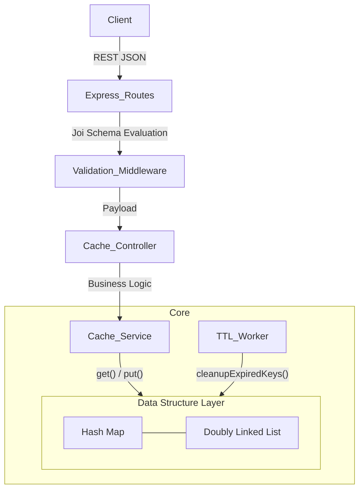

# LRU Cache Server v2 (Clean Architecture)

A production-ready, high-performance in-memory caching service built with Node.js and Express.js. It implements an **LRU (Least Recently Used)** caching algorithm in O(1) time complexity utilizing a combined Hash Map and Doubly Linked List structure. 

This project demonstrates strong backend engineering principles, integrating validation layers, comprehensive logging, clean architectural separation of concerns, and background automated worker processes for memory management.

## Project Overview
Caching stores copies of frequently accessed data in fast temporary memory (RAM) to serve subsequent requests rapidly, minimizing database lookups or network calls. This system uses the LRU policy to evict the oldest unaccessed elements when capacity is breached, maintaining optimal use of memory bounds. Real-world systems like Redis, Memcached, and CDN edge nodes rely heavily on these identical structures.

## Design Decisions
- **Clean Architecture:** Divided into distinct Routes -> Controllers -> Services -> Data Structure layers. This ensures the cache logic can be easily substituted or augmented (e.g., swapping to Redis) without rewriting server endpoints.
- **O(1) Eviction & Insertion:** The Doubly Linked List maintains chronological access states simply by updating local pointer references, bypassing the O(N) array-shift penalties found in standard arrays.
- **Background TTL Cleanup Worker:** While access-time "lazy" evaluation handles standard TTL expiration, a detached `setInterval` background worker actively trims the memory footprint of orphaned stale keys, preserving horizontal stability under load.
- **Observability:** Integrated Winston logging captures latency metrics using `process.hrtime.bigint()` for microsecond accuracy and records server lifecycle events to localized files.

## Architecture Diagram


## API Documentation

### 1. Store a Key-Value Pair
**POST** `/cache`
```json
{
  "key": "user123",
  "value": { "name": "John Doe", "tier": "premium" },
  "ttl": 3600 // optional, in seconds
}
```

### 2. Retrieve a Key
**GET** `/cache/:key`
Returns `200 OK` on hit, or `404 Not Found` upon miss or expiration.

### 3. Delete a Key
**DELETE** `/cache/:key`

### 4. Fetch Architecture Statistics
**GET** `/stats`
Returns current capacity limits and active node counts.

## Setup Instructions

### Local Development
```bash
npm install
npm start
```

### Docker Deployment
```bash
docker-compose up --build
```
Logs will automatically mount to `./logs` directory in the host filesystem.

## Testing & Benchmarks

### Unit Tests
```bash
npm test
```
Validates capacity eviction boundaries, TTL lifecycles, and correct JSON validation drops.

### Load Testing
```bash
npm run benchmark
```
Executes a simulated K6 user ramp up injecting 100 concurrent Virtual Users hitting targeted endpoints.

### Example Benchmark Results
```text
  ✓ is status 200
  ✓ latency under 20ms

  http_req_duration..............: avg=2.83ms   min=0.00ms   med=2.18ms   max=22.38ms  p(90)=5.67ms   p(95)=7.01ms
  http_reqs......................: 133221 (2661.025345/s)
  vus............................: 100
```
